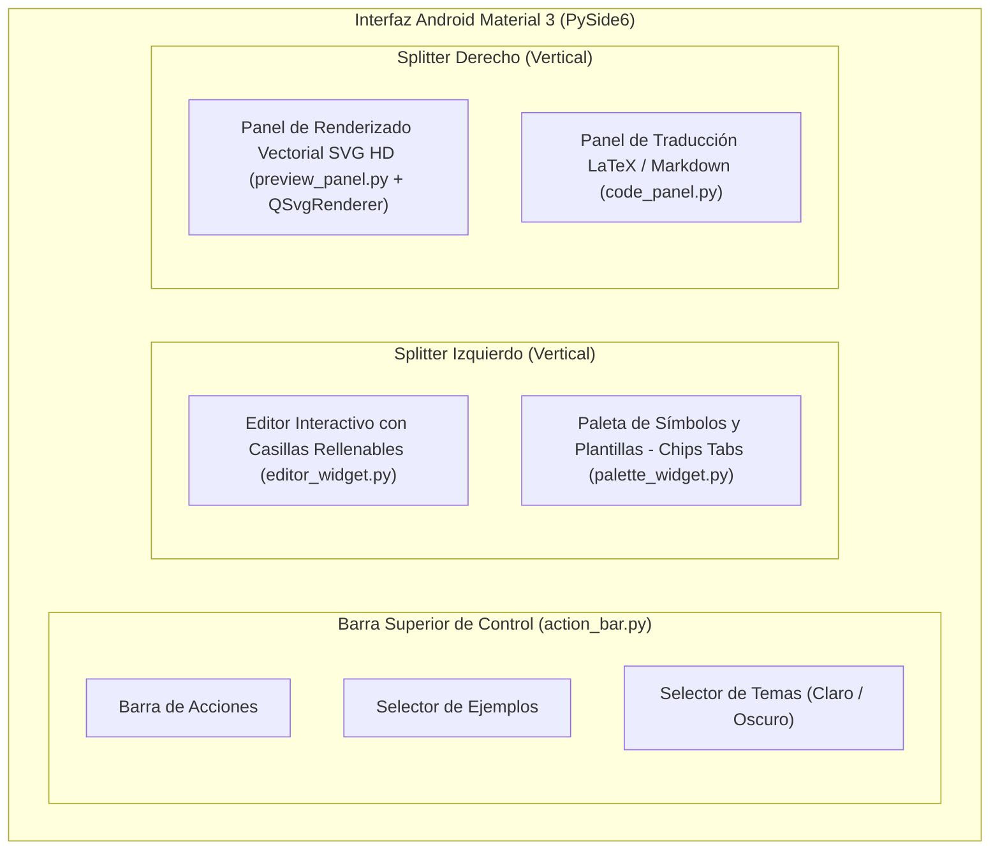
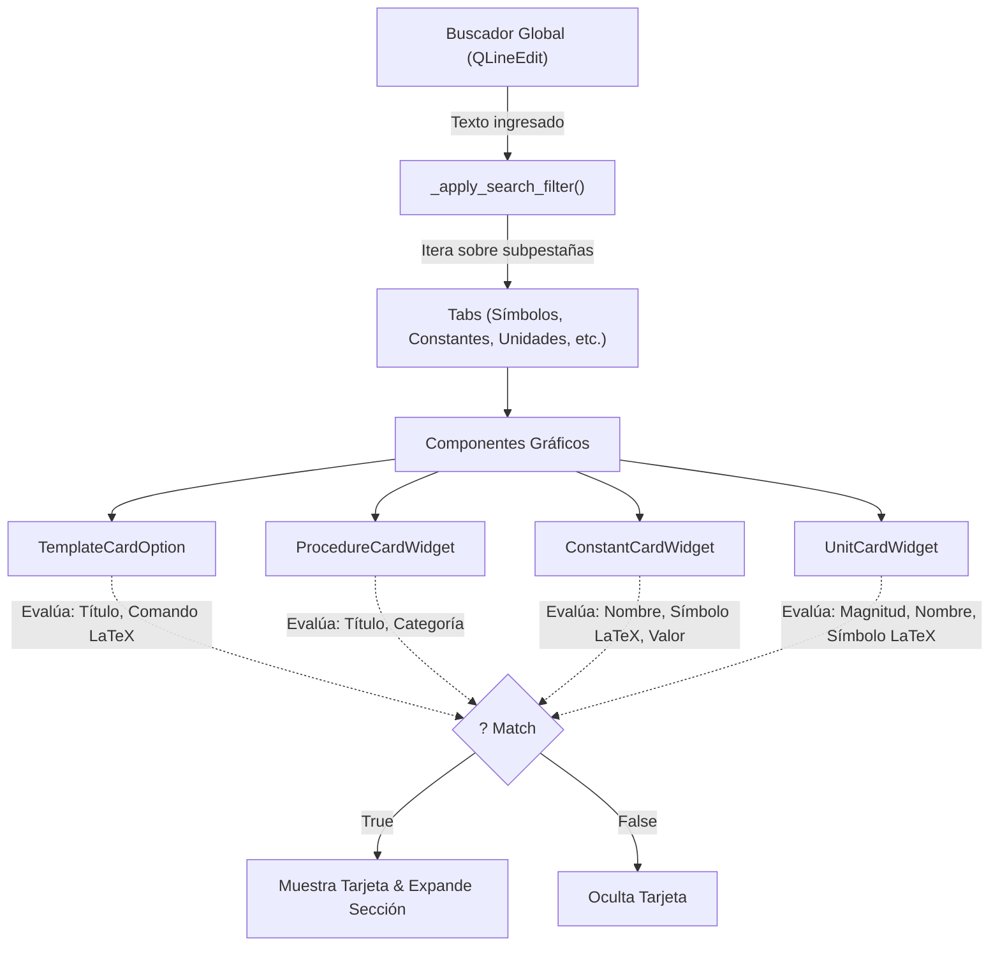

# Arquitectura del Sistema - Traductor Mates & Editor de Ecuaciones

Este documento detalla la arquitectura de software, patrones de diseño y flujo de datos para la aplicación **Traductor Mates**, un editor visual interactivo de fórmulas matemáticas inspirado en la herramienta de ecuaciones de Microsoft Word y la barra de entrada estructurada de Wolfram Alpha, con estética minimalista basada en Android (Material 3).

---

## 1. Visión General del Sistema

**Traductor Mates** es una aplicación de escritorio desarrollada en **Python 3.10+** (utilizando `PySide6` para la interfaz gráfica y un motor síncrono `MiniRacer` con `MathJax` para la renderización matemática vectorial nativa en tiempo real). Permite a los usuarios construir fórmulas matemáticas complejas mediante casillas rellenables (**slots / placeholders `□`**), traducir las fórmulas a código **LaTeX** y **Markdown**, y visualizarlas en tiempo real con una interfaz moderna, minimalista y táctil/fluida estilo Android.



---

## 2. Patrón de Arquitectura y Ejecución Independiente del Sistema Operativo

La aplicación adopta una versión adaptada del patrón **MVC / MVVM (Model-View-ViewModel)** orientado a árboles de sintaxis abstracta (AST) y aislamiento de ventanas del SO:

1. **Modelo (Math AST & State Engine - `src/core/ast.py`)**:
   - Mantiene la estructura jerárquica de la fórmula usando un árbol de nodos (`MathNode`) y contenedores de entrada (`Slot`).
   - Mantiene el historial de estado para deshacer (`Undo`) y rehacer (`Redo`).
   - Gestiona el slot activo y la navegación con teclado (`Tab`, `Shift+Tab`, flechas).

2. **Capa de Traducción y Renderizado Vectorial (`src/core/translator.py` & `src/ui/components/preview_panel.py`)**:
   - **`LaTeXTranslator`**: Recorre el árbol recursivamente y produce código LaTeX válido (`\frac{a}{b}`, `\sqrt[n]{x}`, `\int_{a}^{b}`, `\begin{bmatrix}`, etc.).
   - **`MarkdownTranslator`**: Convierte la fórmula en bloque de código Markdown renderizable (`$$ ... $$`).
   - **`MathPreviewPanel` (Motor Vectorial Nativo)**: Utiliza `QSvgRenderer` de PySide6 para procesar el código XML SVG generado por `SVGMathCache` en tiempo real, renderizando matrices y sistemas de ecuaciones sin limitaciones y permitiendo exportar a `PNG` de alta resolución y escalar vectores `SVG` puros.
   - **`SVGMathCache` (Renderizado Centralizado)**: Caché unificada (Singleton) que ejecuta el bundle modular de MathJax v3 en un contexto V8 aislado (`MiniRacer`) para alimentar todas las vistas, tarjetas y botones UI de forma síncrona y pura en memoria.
3. **Ejecución Ventana GUI Pura (`pythonw` / Multiplataforma)**:
   - Para evitar ventanas transparentes o consolas vacías de PowerShell/CMD en Windows, el inicio de la app utiliza `pythonw.exe` (lanzador sin ventana de consola).
   - En Linux/macOS, se ejecuta mediante `python3 main.py`.

4. **Persistencia y Registros del Sistema**:
   - **`MEMORY.md`**: Registro de hitos, arquitectura, aciertos y errores con marcas de tiempo en **minutos**.
   - **`PROCESS.md`**: Registro detallado de la sesión con marcas de tiempo en **segundos** para prevención de pérdida de datos.

5. **Estándares de Documentación Interna**:
   - Se utiliza **Google Style Docstrings** de manera mandatoria para todas las funciones y clases complejas, logrando una documentación estructurada y compatible con analizadores como `pydoclint`.

---

## 3. Modelo de Datos y Estructura en Árbol (Slot Tree Engine)

### 3.1 Clases Principales de Nodos

- **`Slot`**: Es un contenedor editable que alberga una lista ordenada de objetos `MathNode`. Representa una "casilla vacía" (`□`) cuando está vacío o el contenido insertado.
- **`MathNode`** *(Clase base abstracta)*:
  - **`TextNode`**: Caracteres alfanuméricos u operadores planos (`x`, `+`, `5`, `=`).
  - **`SymbolNode`**: Símbolos matemáticos especiales (`\alpha`, `\infty`, `\times`, `\le`, `\pi`).
  - **`TemplateNode`** *(Estructuras rellenables)*:
    - `FractionNode`: Posee dos slots (`numerator`, `denominator`).
    - `PowerNode`: Posee dos slots (`base`, `exponent`).
    - `SubscriptNode`: Posee dos slots (`base`, `subscript`).
    - `RootNode`: Posee slots (`radicand`, `index`).
    - `IntegralNode`: Posee slots (`lower`, `upper`, `body`, `variable`).
    - `SummationNode`: Posee slots (`lower`, `upper`, `body`).
    - `LimitNode`: Posee slots (`variable`, `target`, `expression`).
    - `MatrixNode`: Grid $R \times C$ de slots (`slots[row][col]`).
    - `BracketsNode`: Envolvente con slots y delimitadores ajustables (`\left( ... \right)`).

---

## 4. Estructura de Archivos del Proyecto y Representaciones en `docs/`

La estructura física y lógica de directorios del proyecto se documenta en múltiples formatos dentro de `docs/` excluyendo estrictamente los patrones del archivo `.gitignore` (`.venv/`, `__pycache__/`, `.pytest_cache/`, `scratch/`, etc.):

- **JSON Estructurado (`docs/directorios.json`)**: Árbol jerárquico de archivos y carpetas en formato JSON estándar.
- **JSONC Comentado (`docs/directorios_comentados.jsonc`)**: Árbol en formato JSONC incorporando comentarios explícitos (`//`) sobre el propósito y función de cada script/directorio enriquecido con metadatos.
- **YAML (Especificación de Arquitectura)**: Representación en sintaxis YAML a continuación.

```yaml
TRADUCTOR MATES:
  - .gitignore
  - AGENTS.md
  - MEMORY.md
  - PROGRESS.md
  - README.md
  docs:
    - ARCHITECTURE.md
    - directorios.json
    - directorios_comentados.jsonc
  - main.py
  mathjax_build:
    - build.js
    - engine.js
    - index.js
    - package.json
    - package_config.js
    - renderer.js
    - sanitizer.js
  - pyproject.toml
  - run_app.bat
  - run_qa.bat
  - setup_venv.bat
  src:
    - README.md
    - __init__.py
    assets:
      - mathjax_bundle.js
    core:
      - README.md
      - __init__.py
      - ast.py
      - logger.py
      - parser.py
      - renderer.py
      - syntax.py
      - translator.py
    data:
      - README.md
      - __init__.py
      - constants.py
      - symbols.py
      - units.py
    ui:
      - README.md
      - __init__.py
      components:
        - __init__.py
        - action_bar.py
        - bracket_widget.py
        - code_panel.py
        - constant_card.py
        - edit_formula_dialog.py
        - editor_widget.py
        - help_dialog.py
        - log_dialog.py
        - palette_widget.py
        - preview_panel.py
        - procedure_card.py
        - save_formula_dialog.py
        - svg_cache.py
        - template_card.py
        - unit_card.py
      - main_window.py
      - theme.py
    utils:
      - README.md
      - __init__.py
      - favorites_manager.py
      - qt_utils.py
      - recovery_manager.py
      - user_formulas_manager.py
  tests:
    - README.md
    - __init__.py
    - test_ast.py
    - test_editor_widget.py
    - test_mathjax_build.js
    - test_mathjax_bundle.js
    - test_parser.py
    - test_syntax.py
    - test_theme.py
    - test_translator.py
```

## 5. Lógica de Componentes Dinámicos y Buscador Global

La aplicación cuenta con una robusta paleta de componentes interactivos (Plantillas, Símbolos, Fórmulas, Constantes y Unidades). A continuación se muestra el flujo del buscador integrado:




## 6. Scripts de Utilidad para POSIX (Linux/macOS)

Como el desarrollo se lleva a cabo principalmente en Windows (usando los archivos `.bat`), los scripts `.sh` para sistemas POSIX (Linux/macOS) se han extraído del directorio raíz para reducir el ruido en el espacio de trabajo. Se documentan a continuación por si en el futuro se requiere retomar la compatibilidad cruzada de entorno.

### `run_app.sh`
```bash
#!/usr/bin/env bash
if [ ! -d ".venv" ]; then
    echo "El entorno .venv no existe. Ejecutando setup_venv.sh..."
    bash setup_venv.sh
fi
source .venv/bin/activate
python main.py
```

### `run_qa.sh`
```bash
#!/bin/bash
echo "=============================================="
echo " Iniciando Evaluacion de Calidad (QA Pipeline)"
echo "=============================================="
echo ""
echo "[1/5] Ejecutando Ruff (Linter y Formato)..."
python3 -m ruff check src/ tests/
echo "[2/5] Ejecutando Pydoclint (Google Style Docstrings)..."
python3 -m pydoclint src/
echo "[3/5] Ejecutando Mypy (Tipado Estatico)..."
python3 -m mypy src/
echo "[4/5] Ejecutando Pytest (Pruebas Unitarias Python)..."
python3 -m pytest tests/
echo "[5/5] Ejecutando Node.js (Pruebas Unitarias JavaScript)..."
node --test tests/test_mathjax_build.js tests/test_mathjax_bundle.js
```

### `setup_venv.sh`
```bash
#!/usr/bin/env bash
echo "Creando entorno virtual .venv..."
python3 -m venv .venv
echo "Instalando dependencias en .venv..."
source .venv/bin/activate
pip install --upgrade pip
pip install -e .
```
