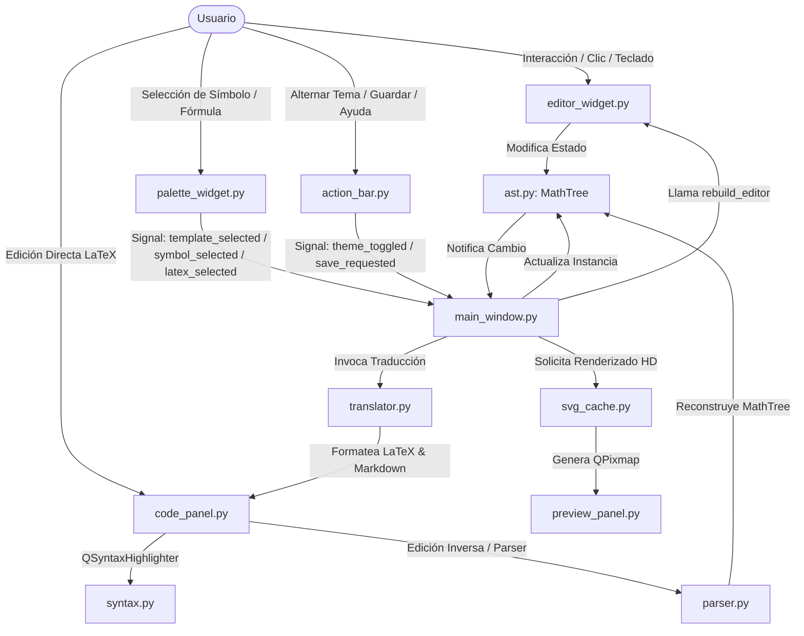

# Documentación Interna del Código Fuente (`src/`) 🧮

Este documento proporciona una guía exhaustiva y detallada sobre la estructura, funcionamiento, parámetros y la interconexión de todos los scripts que componen el paquete `src/` de la aplicación **Traductor Mates**.

---

## 1. Visión General de la Estructura de Scripts 📂

La carpeta `src/` está organizada modularmente siguiendo una variante del patrón de arquitectura **MVC / MVVM (Model-View-ViewModel)** adaptado a un árbol de sintaxis abstracta (AST) para fórmulas matemáticas de dos dimensiones.

```yaml
src:
  description: "Paquete principal del código fuente de Traductor Mates"
  files:
    - __init__.py: "Inicializador del paquete principal con metadatos estructurados"
  subdirectories:
    assets:
      description: "Recursos estáticos de la aplicación (MathJax Bundle modular para MiniRacer V8)"
      files:
        - mathjax_bundle.js: "Bundle modular optimizado de MathJax v3 compilado con esbuild para MiniRacer V8"
    core:
      description: "Motor Lógico (AST, Parser, Renderer, Sintaxis y Traductor)"
      files:
        - __init__.py: "Inicializador del motor lógico"
        - ast.py: "Árbol de sintaxis abstracta, jerarquía de nodos matemáticos y motor de casillas (Slots)"
        - logger.py: "Sistema centralizado de registro de eventos y códigos de diagnóstico"
        - parser.py: "Parser inverso de texto LaTeX a MathTree (AST)"
        - renderer.py: "Renderizador utilitario de soporte"
        - syntax.py: "Motor de resaltado sintáctico estricto y coloreado semántico"
        - translator.py: "Traductor bidireccional AST -> LaTeX / Markdown"
    data:
      description: "Catálogo y Bibliotecas de Datos (fórmulas, constantes, unidades y persistencia de usuario)"
      files:
        - __init__.py: "Inicializador del paquete de datos con tipado estricto"
        - symbols.py: "Biblioteca maestra de símbolos, plantillas y catálogo compendio de fórmulas"
        - constants.py: "Catálogo de constantes físicas y matemáticas según el estándar CODATA 2022"
        - units.py: "Catálogo de magnitudes fundamentales y derivadas del Sistema Internacional (SI)"
        - user_formulas_data.json: "Persistencia local de fórmulas y variantes creadas por el usuario"
    ui:
      description: "Capa de Interfaz de Usuario (PySide6 / Material 3 y Hatsune Miku Theme)"
      files:
        - __init__.py: "Inicializador del paquete de UI"
        - main_window.py: "Ventana principal integradora en 4 cuadrantes balanceados y splitters"
        - theme.py: "Sistema de diseño dinámico, paletas Miku (Dark/Light) y generador QSS"
      subdirectories:
        components:
          description: "Componentes gráficos modulares de la interfaz"
          files:
            - __init__.py: "Inicializador de componentes de interfaz"
            - action_bar.py: "Barra de herramientas superior, alternancia de temas, logs y botón de ayuda"
            - bracket_widget.py: "Dibujado vectorial adaptativo de delimitadores, paréntesis y raíces"
            - code_panel.py: "Panel de salida de código LaTeX/Markdown con portapapeles, selector de fuente y Toast"
            - constant_card.py: "Tarjeta interactiva para inserción de constantes con control de decimales"
            - edit_formula_dialog.py: "Diálogo modal para edición de fórmulas y gestión de variantes paso a paso"
            - editor_widget.py: "Editor estructural interactivo 2D de casillas rellenables [ □ ]"
            - help_dialog.py: "Diálogo modal de ayuda y manual interactivo de usuario en Markdown/HTML"
            - log_dialog.py: "Cuadro de diálogo modal para visualización en tiempo real de logs de sesión"
            - palette_widget.py: "Paleta con buscador integrado, símbolos, plantillas, catálogo, constantes y unidades"
            - preview_panel.py: "Panel de visualización renderizada SVG/KaTeX con zoom adaptativo y exportación PNG/SVG"
            - procedure_card.py: "Tarjeta interactiva con carrusel para desglosar variaciones de fórmulas"
            - save_formula_dialog.py: "Diálogo modal para guardar fórmulas personalizadas con previsualización en vivo"
            - svg_cache.py: "Motor de renderizado SVG y caché síncrono vía MiniRacer V8"
            - template_card.py: "Tarjeta interactiva de selección de plantilla estructurada"
            - unit_card.py: "Tarjeta interactiva para inserción de unidades físicas y magnitudes"
    utils:
      description: "Utilidades transversales y gestores de persistencia"
      files:
        - __init__.py: "Inicializador del paquete de utilidades"
        - favorites_manager.py: "Gestor de símbolos y plantillas favoritas del usuario"
        - recovery_manager.py: "Gestor de auto-guardado en caliente para recuperación ante caídas (Crash Recovery)"
        - user_formulas_manager.py: "Gestor de persistencia y ordenamiento de fórmulas de usuario"
        - qt_utils.py: "Funciones de utilidad para manipulación segura de layouts Qt"
```

## 2. Puntos de Entrada y Protección (Runtime)

### `main.py` (Entry Point)
Punto de arranque que inicializa el bucle de eventos `QApplication`. Adicionalmente, implementa un **Global Exception Hook (`sys.excepthook`)**, que intercepta cualquier cierre inesperado o excepción no manejada y la registra de manera segura en el `session.log` previniendo colapsos ciegos.

---

## 3. Cabecera de Metadatos YAML en Scripts 🏷️

Todos los scripts dentro del paquete `src/` cuentan con una cabecera de metadatos en formato **YAML** integrada al inicio de la docstring del módulo para facilitar la inspección automática y la documentación técnica.

Ejemplo de estructura de metadatos según [`docs/base/frontmatter_yaml.md`](docs/base/frontmatter_yaml.md):
```python
"""
---
file: src/core/ast.py
module: src.core.ast
description: Motor del Árbol de Sintaxis Abstracta (AST) y jerarquía de nodos matemáticos bidimensionales.
type: core/engine
version: 1.0.0
date: 2026-08-24
dependencies:
  - src.core.logger
relations:
  - docs/ARCHITECTURE.md
  - src/core/parser.py
  - src/core/translator.py
exports:
  - Slot: "Contenedor secuencial de texto y nodos interactivos"
  - MathTree: "Árbol AST raíz que gestiona el cursor y la navegación"
test: pytest tests/test_ast.py
constraints:
  - "Todos los métodos que mutan casillas deben emitir la señal tree_changed"
keywords:
  - ast
  - math-tree
  - slot-box
  - math-node
---
"""
```

---

## 4. Documentación Unificada de Paquetes 📚

### 🎨 Módulo de Recursos Estáticos (`src/assets`)
Este directorio contiene los recursos estáticos y dependencias necesarias para la visualización y renderizado de fórmulas en alta definición.
* **`mathjax_bundle.js`**: Bundle modular optimizado de MathJax v3 generado mediante `esbuild` desde `mathjax_build/` (`package_config.js`, `sanitizer.js`, `engine.js`, `renderer.js`, `index.js`). Configurado con `fontCache: 'none'` para generar código SVG plano en memoria mediante MiniRacer (V8), con cabecera de metadatos YAML, docstrings Google Style y sanitización estricta para PySide6 TinySVG.

### 🧠 Motor Lógico (`src/core`)
El cerebro del renderizado, la traducción, el análisis léxico y el estado abstracto.
* **`ast.py`**: Define el estado de la ecuación matemática como un árbol jerárquico de nodos y casillas (*Slots*). Implementa `Slot`, nodos lógicos como `MathNode`, `FractionNode`, `ProductNode`, `ModularNode`, integrales dobles/triples y el gestor principal `MathTree`.
* **`logger.py`**: Sistema central de logging global que implementa `SessionLogger` para capturar eventos y diagnósticos en `session.log`.
* **`parser.py`**: Parser inverso (clase `LaTeXParser`) que transforma comandos anidados en código LaTeX de vuelta hacia un objeto `MathTree` modificable en pantalla.
* **`renderer.py`**: Renderizador vectorial utilitario de soporte.
* **`syntax.py`**: Responsable del resaltado de sintaxis estricto en el código fuente. Implementa `LaTeXSyntaxHighlighter`.
* **`translator.py`**: Traductor bidireccional encargado de transformar el árbol visual (`MathTree`) hacia LaTeX y bloques Markdown.

### 📚 Catálogo de Datos (`src/data`)
Alberga las bases de datos estáticas, diccionarios de símbolos, constantes y fórmulas preestablecidas.
* **`symbols.py`**: Biblioteca maestra que contiene `CATEGORIES`, `TEMPLATES`, `SYMBOLS` y `PRESET_FORMULAS` organizadas en 9 ramas matemáticas y físicas con constructores AST.
* **`constants.py`**: Catálogo de constantes físicas universales CODATA 2022 con valores numéricos y tipado estricto.
* **`units.py`**: Catálogo de magnitudes fundamentales y derivadas del SI con representaciones dimensionales.

### 🖥️ Capa de Interfaz Gráfica (`src/ui`)
Implementación visual interactiva construida sobre PySide6, bajo un paradigma modular de diseño inspirado en Android Material 3 y Hatsune Miku Theme.
* **`main_window.py`**: Contenedor principal que coordina los paneles usando `QSplitter` y sincroniza datos mediante señales Qt.
* **`theme.py`**: Diccionario de colores Miku (Cyan `#39C5BB` / Magenta `#E3327B`) y generador dinámico de hojas de estilo (QSS).
* **Componentes (`src/ui/components`)**: 
  - **`action_bar.py`**: Barra superior de control (temas, logs, ayuda).
  - **`editor_widget.py`**: El corazón estructural 2D; renderiza el árbol `MathTree` interactivamente.
  - **`code_panel.py`**: Panel lateral de código LaTeX con portapapeles, selector de escala tipográfica y notificaciones Toast.
  - **`preview_panel.py`**: Panel renderizador de alta definición con zoom adaptativo y exportador PNG/SVG.
  - **`palette_widget.py`**: Paleta con pestañas de Favoritos, Plantillas, Símbolos, Fórmulas, Constantes, Unidades y Usuario.
  - **`procedure_card.py`**: Tarjetas con carrusel para navegación y selección de variantes paso a paso.
  - **`constant_card.py`** y **`unit_card.py`**: Tarjetas interactivas con configuración contextual de precisión decimal.
  - **`edit_formula_dialog.py`** y **`save_formula_dialog.py`**: Cuadros de diálogo modales para persistencia y edición de variantes.
  - **`help_dialog.py`** y **`log_dialog.py`**: Ventanas modales de documentación y visor de registros de sesión.
  - **`svg_cache.py`**: Motor síncrono singleton para compilación LaTeX a SVG vía MiniRacer V8.

### 🛠️ Utilidades Transversales (`src/utils`)
* **`favorites_manager.py`**: Sistema de persistencia que almacena los identificadores favoritos en `~/.traductor_mates_favorites.json`.
* **`recovery_manager.py`**: Gestor de auto-guardado que respalda en caliente la ecuación en un archivo temporal (Crash Recovery).
* **`user_formulas_manager.py`**: Gestor de persistencia y ordenamiento jerárquico de fórmulas y variantes de usuario en `src/data/user_formulas_data.json`.
* **`qt_utils.py`**: Funciones puras de manipulación de UI, destacando `clear_layout()` para liberación de memoria.

---

## 5. Interconexión y Flujo de Datos entre Scripts 🔄

La aplicación funciona mediante un patrón **Unidirectional Event & Data Flow** impulsado por el sistema de señales y slots de PySide6 (`Signal` / `Slot`).



---
*Documentación técnica del paquete `src/` (Versión 2.1.0).*
